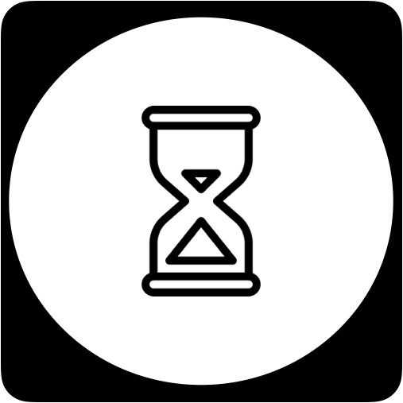
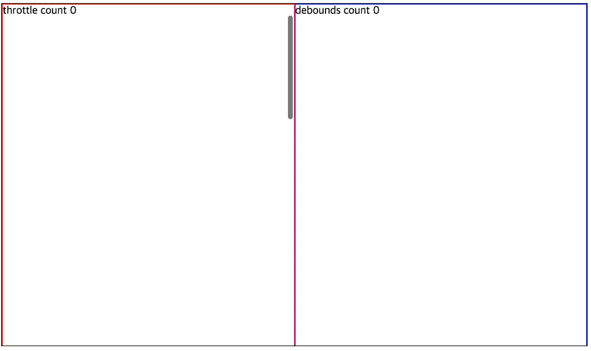

<p align="center">
    <a href="https://seonhyungjo.github.io/use-delay/"></a>

<h1 align="center">React useDelay Hooks</h1>

<div align="center">

[](https://www.npmjs.com/package/use-delay) [](https://standardjs.com)



</div>

## Install

```bash
npm install --save use-delay
```

## Usage

```tsx
import React, { useCallback, useState } from 'react'
import { useThrottle, useDebounds } from 'use-delay'

const App = () => {
  const [throttleCount, setThrottleCount] = useState(0);
  const [deboundsCount, setDeboundsCount] = useState(0);
  const actionThrottleHandle = useCallback(() => {
    setThrottleCount(throttleCount + 1)
  })

  const actionDeboundsHandle = useCallback(() => {
    setDeboundsCount(deboundsCount + 1)
  })

  const onTrottle = useThrottle(1000, actionThrottleHandle)
  const onDebounds = useDebounds(1000, actionDeboundsHandle)

  return (
    <div className={"outerDiv"}>
      <div className={"throttleDiv"} onScroll={onTrottle}>
        <div className={"fixcount"}>
          {`throttle count ${throttleCount}`}
        </div>
        <div className={"innerDiv"}>
          throttle
        </div>
      </div>

      <div className={"deboundsDiv"} onScroll={onDebounds}>
        <div className={"fixcount"}>
          {`debounds count ${deboundsCount}`}
        </div>
        <div className={"innerDiv"}>
          debounds
        </div>
      </div>
    </div>
  )
}
export default App
```


```css

* {
 box-sizing: border-box;
}

.outerDiv {
  display: block;
  width: 100%;
  height: 500px;
  overflow-x: hidden;
  overflow-y: scroll;
  border: 1px solid #000
}

.throttleDiv {
  display: inline-block;
  width: 50%;
  height: 500px;
  overflow-x: hidden;
  overflow-y: scroll;
  border: 1px solid red;
}

.deboundsDiv {
  display: inline-block;
  width: 50%;
  height: 500px;
  overflow-x: hidden;
  overflow-y: scroll;
  border: 1px solid blue;
}

.innerDiv {
  width: 100px;
  height: 100px;
  border: 1px solid green;

  margin-top: 1500px;
}

.fixcount {
  position: fixed;
}
```

## License

MIT © :mouse:[snyung](https://github.com/seonhyungjo)

---

This hook is created using [create-react-hook](https://github.com/hermanya/create-react-hook).
